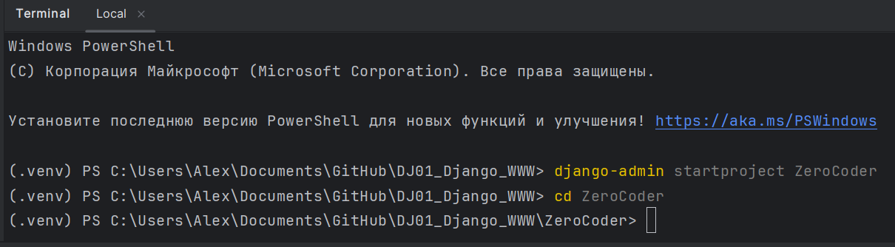

# DJ01_Django_WWW API
 DJ01_Введение в Django и создание проекта

Команды - сразу создаёт многое:

django-admin startproject ZeroCoder

cd ZeroCoder

python manage.py runserver

###

python manage.py startapp main

migrations: папка для миграций, необходимых для работы с базами данных;

__init__.py: файл, который запускается при инициализации (запуске) пакета;

admin.py: здесь мы будем указывать, какие таблицы отображать в админ-панели;

apps.py: файл с настройками, но не общими, а для конкретного приложения main;

models.py: файл для создания моделей, на основе которых будут создаваться таблицы в базе данных;

tests.py: файл для написания каких-либо тестирований проекта;

views.py: файл для отображения HTML-шаблонов. При получении URL-адреса произойдет переход на какую-либо HTML-страницу.

###

python manage.py runserver